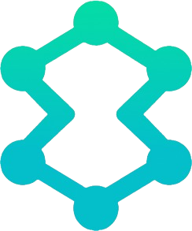

<p align="center">
  
</p>

<h1 align="center">Solvix</h1>

<p align="center">
  Resilient API Infrastructure for Modern Javascript Applications
</p>

<p align="center">
  Enterprise-Grade HTTP Orchestration Engine
</p>

<p align="center">
  Resilience • Security • Observability • Control
</p>

<p align="center">
  
  
  
  
  
  
</p>

---

Solvix is a powerful HTTP orchestration layer designed for modern applications and enterprise systems.

It transforms simple API requests into secure, observable, resilient, and fully controlled execution pipelines.

Unlike traditional HTTP clients, Solvix does not only send requests — it manages the entire lifecycle of network communication.

---

# The Problem Solvix Solves

In real-world applications, API communication is rarely simple.

Production systems require:

- Intelligent retry strategies
- Circuit breaking to prevent cascading failures
- Rate limiting to respect quotas
- Request prioritization
- Dependency coordination
- Production snapshot debugging
- Token refresh orchestration
- Offline handling (browser)
- Secure request enforcement
- Observability and profiling
- API migration shadow testing
- Transport flexibility

Most libraries leave these responsibilities to developers.

Solvix integrates them into a single cohesive orchestration engine.

---

# Installation

```bash
npm install solvix
```

---

# Quick Start

```ts
import { createClient } from "solvix";

const api = createClient({
  baseURL: "https://api.example.com",
});

const response = await api.get("/users");

console.log(response.data);
```

---

# Architecture Overview

Every request flows through a controlled pipeline:

1. Security Resolution
2. Request Group / Dependency Handling
3. Priority Queue Scheduling
4. Rate Limiting
5. Circuit Breaker Check
6. Retry Engine
7. Transport Execution
8. Response Parsing
9. Timeline Tracking
10. Snapshot & Profiling
11. Global Event Bus Emission

Solvix treats HTTP as infrastructure, not a utility.

---

# Intelligent Retry Engine

### What It Solves

Temporary failures, unstable networks, server errors.

### Features

- Exponential backoff
- Adaptive retry (based on network timing)
- Abort-aware delays
- Retry normalization

```ts
const api = createClient({
  retry: {
    retries: 3,
    factor: 2,
    minTimeout: 300,
    maxTimeout: 5000,
  },
});
```

---

# Circuit Breaker

Prevents overwhelming failing services.

```ts
const api = createClient({
  circuitBreaker: {
    failureThreshold: 5,
    failureRate: 0.5,
    rollingWindow: 10000,
    minimumRequests: 10,
    resetTimeout: 15000,
    halfOpenRequests: 2,
  },
});
```

---

# Rate Limiter (Token Bucket)

Prevents exceeding API quotas.

```ts
const api = createClient({
  rateLimit: {
    capacity: 10,
    refillRate: 5,
    interval: 1000,
  },
});
```

---

# Priority Queue

Control execution order and concurrency.

```ts
api.get("/background", { priority: 10 });
api.get("/critical", { priority: 1 });
```

Supports:

- Max concurrency
- Queue size control
- FIFO / priority strategy

---

# Timeline Tracking & Profiling

Understand exactly how requests behave in production.

```ts
const api = createClient({
  timeline: { enabled: true },
  profiling: { enabled: true },
});

const res = await api.get("/users");

console.log(res.meta.timeline);
console.log(res.meta.profile);
```

Tracks:

- created
- queued
- dequeued
- breakerCheck
- transportStart
- responseReceived
- parseStart
- parseEnd
- completed
- failed

---

# Snapshot Mode (Production Debugging)

Capture structured metadata for diagnostics.

```ts
const api = createClient({
  snapshot: { enabled: true },
});
```

Snapshot includes:

- URL
- method
- duration
- retries
- redacted headers
- timeline
- error details

Sensitive headers are automatically masked.

---

# Enterprise Security Layer

Multi-layer configurable protection.

```ts
const api = createClient({
  security: {
    enforceHttps: true,
    allowedMethods: ["GET", "POST"],
    allowedDomains: ["api.example.com"],
    maxBodySize: 1_000_000,
    sanitizeHeaders: true,
    strictMode: true,
  },
});
```

Security features include:

- HTTPS enforcement
- Domain restrictions
- Method restrictions
- Header sanitization
- Snapshot redaction
- Body size guards
- Strict security preset

---

# Request Groups

Abort multiple related requests together.

```ts
import { RequestGroup } from "solvix";

const group = new RequestGroup();

api.get("/a", { group });
api.get("/b", { group });

group.abort();
```

---

# Dependency Chains

Ensure ordered execution in complex flows.

```ts
await api.get("/auth", { id: "auth" });

await api.get("/profile", {
  dependsOn: ["auth"],
});
```

---

# Shadow Mode (Primary + Secondary APIs)

Safely test new APIs in production.

```ts
const api = createClient({
  shadow: {
    secondaryBaseURL: "https://new-api.example.com",
    compareResponse: true,
    onDifference(primary, secondary) {
      console.log("Response mismatch detected");
    },
  },
});
```

Shadow execution never blocks the primary response.

---

# Offline Queue (Browser)

Queue requests when offline and replay later.

```ts
const api = createClient({
  offlineQueue: { enabled: true },
});
```

---

# ETag / Conditional Requests

Supports conditional requests to reduce bandwidth usage.

---

# Automatic Token Refresh

Centralized refresh orchestration for expired authentication tokens.

---

# Global Event Bus

Observe request lifecycle globally.

```ts
import { SolvixBus } from "solvix";

SolvixBus.on("request:start", (event) => {
  console.log(event.context.url);
});
```

Events:

- request:start
- request:retry
- request:error
- request:complete
- request:shadowStart
- request:shadowComplete
- request:shadowDifference
- request:shadowError

---

# Transport-Agnostic Mode

Override transport layer (HTTP2, RPC, custom adapters).

```ts
const api = createClient({
  transport: async (ctx) => {
    // Custom implementation
  },
});
```

---

# Supported HTTP Methods

- GET
- POST
- PUT
- PATCH
- DELETE
- HEAD
- OPTIONS

---

# Roadmap

- OpenTelemetry integration
- Plugin ecosystem
- Advanced monitoring adapters
- Performance optimizations
- Observability dashboards

---

# 🤝 Contributing

We welcome:

- Feature proposals
- Architecture discussions
- Bug reports
- Security reviews
- Performance improvements

Infrastructure grows stronger through collaboration.

---

# 📄 License

MIT License

---

# Philosophy

HTTP should not be fragile.

Solvix transforms API communication into a reliable, observable, secure, and orchestrated execution system.

It is not just a client.

It is infrastructure.
